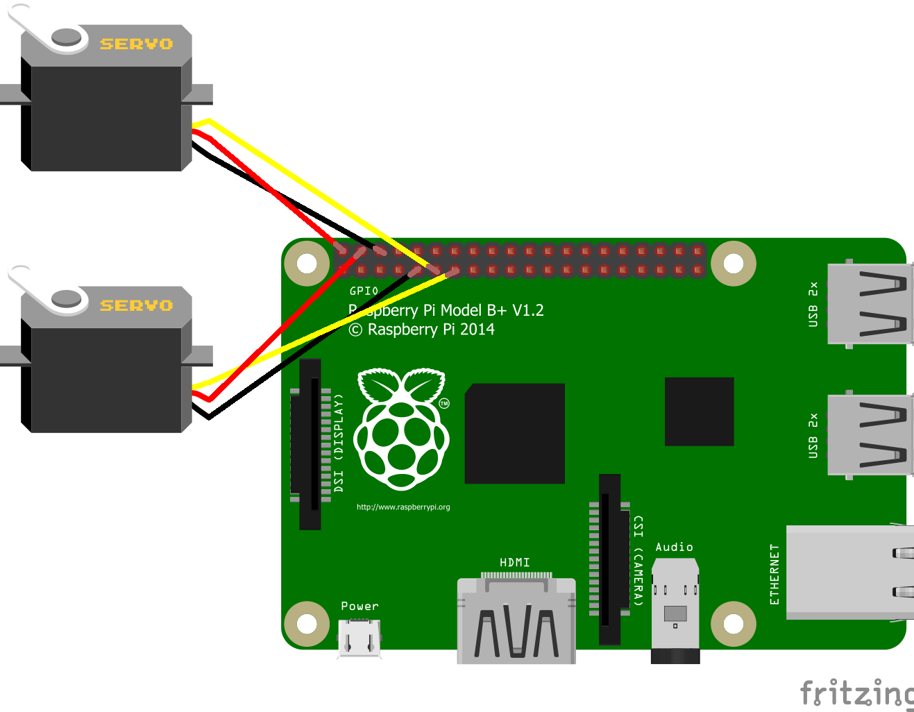

# RealtimeTracking

Real time face tracking for Webcam/Raspberry Pi with support for feedback to motors for pan & tilt control

## Face tracking setup

### Raspberry Pi

#### Using Raspberry Pi camera
1. Enable Raspberry Pi camera in Configuration->Interfaces
2. [Install Python & OpenCV](https://www.pyimagesearch.com/2019/09/16/install-opencv-4-on-raspberry-pi-4-and-raspbian-buster/) 
3. Install the requirements by running `pip install -r requirements_raspberrypi.txt`
4. Run the app with `python3 main.py -c raspberrypi`

#### Using Webcam
1. [Install Python & OpenCV](https://www.pyimagesearch.com/2019/09/16/install-opencv-4-on-raspberry-pi-4-and-raspbian-buster/) 
3. Install the requirements by running `pip install -r requirements_webcam.txt`
4. Run the app with `python3 main.py -c webcam`

### PC & Webcam
Please note: Motor interaction is not enabled for PC
1. [Install Python](https://www.python.org/downloads/)
2. Install the requirements by running `pip install -r requirements_webcam.txt`
3. Run the app with `python main.py -c webcam`

### Optional arguments
- `--haarcascade_path`: Path to Haar cascade classifier file (xml)
- `--min_face_scale`: Minimum face size relative to video size (percentage). Using smaller values decreases performance. Default is 30%
- `--preview`: Whether to show the video stream (on by default)
- `--draw_box`: Whether to draw a box around the face (on by default)
- `--fps`: Whether to show fps counter (off by default)

You can add these arguments onto the `main.py` (i.e. `python3 main.py -c rasperrypi --fps 1`)

## Motor control setup
1. Connect servos to Raspberry pi
- Connect red wires to 5V pins (2 in the top left). Ensure your servos are 5V before doing so
- Connect black wires to ground (3rd pin on the top and 5th pin on the bottom)
- Connect yellow wires to GPIO pins (pan to GPIO 17/6th pin on the bottom and tilt to GPIO 27/7th on the bottom)

2. Add `-m 1` to the `main.py` command (i.e. `python3 main.py -c rasperrypi -m 1`)
